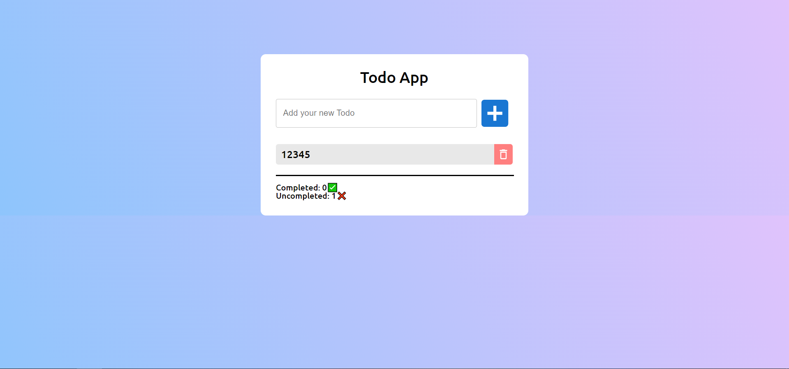

# Nitrix-test-task

A multi-container Docker-compose app with MERN stack.

## Demo

## Installation Instructions
**Prerequisites:**
1. [Docker](https://www.docker.com/get-started/)  
2. [Mongo DB Cluster](https://www.mongodb.com/)

**Clone and Run**
1. `git clone https://github.com/rostyslavnahornyi/Nitrix-test-task.git <path>`
2. `cd <path>`
3. In the **server/.env** file you should replace *\<username\>* and *\<password\>* to your data from MongoDb
4. `docker-compose up`